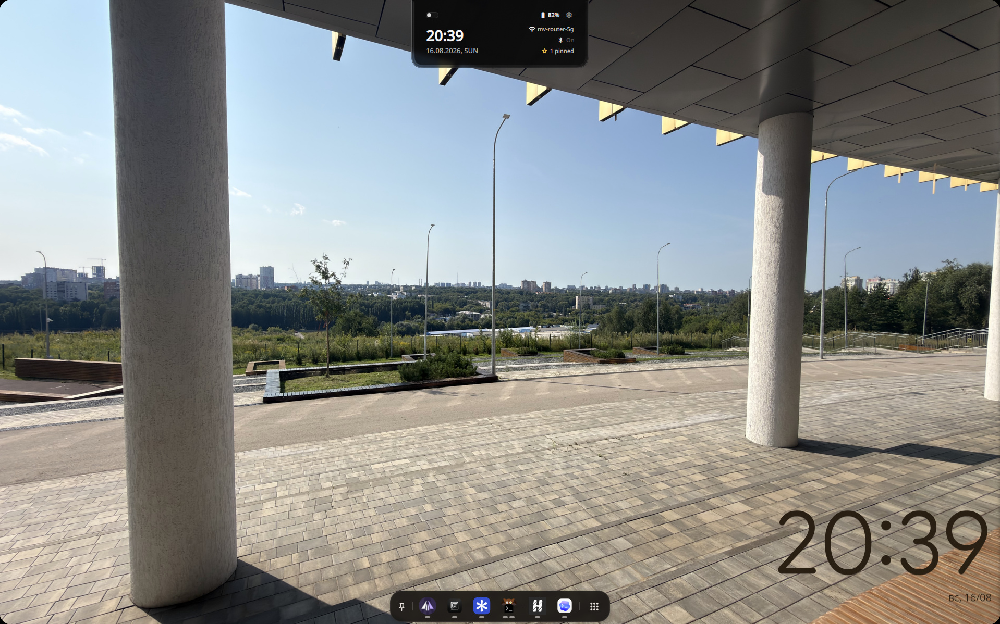
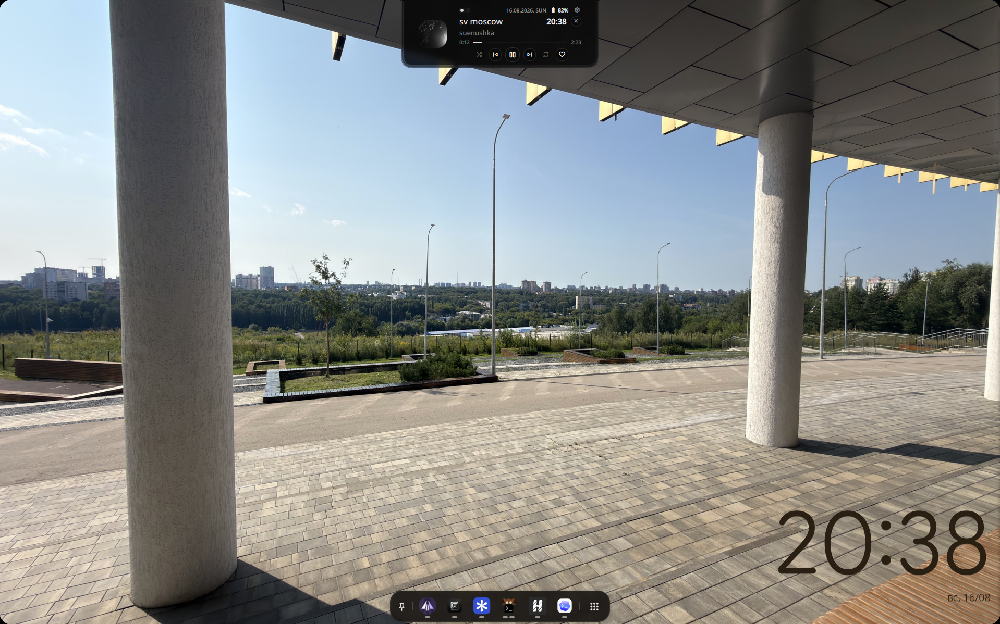
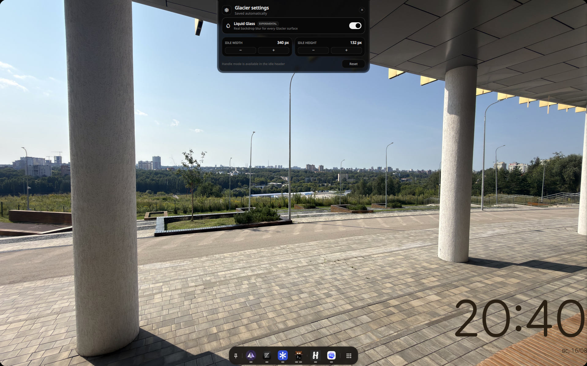
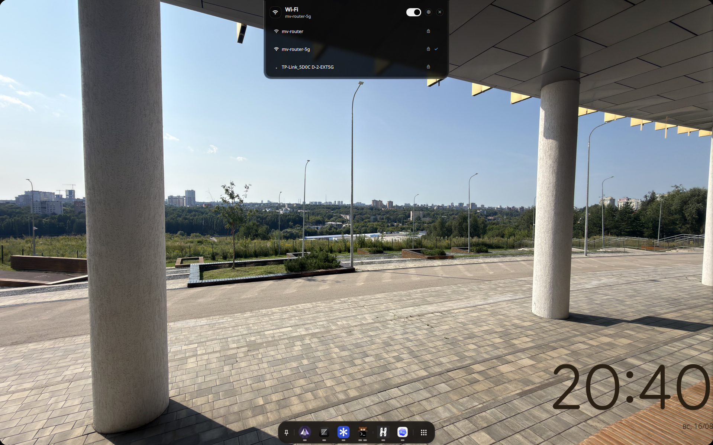
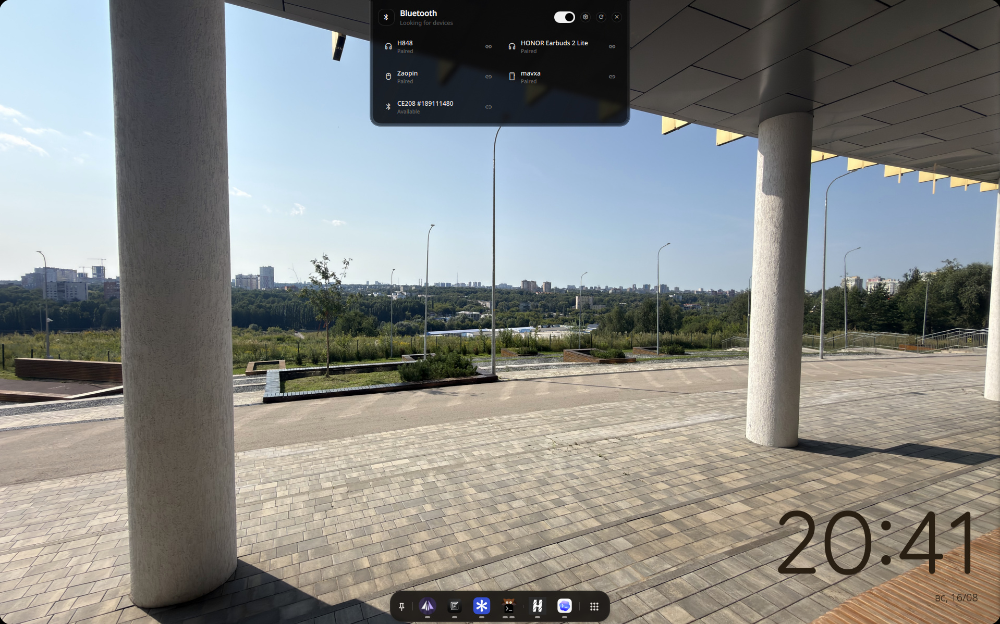
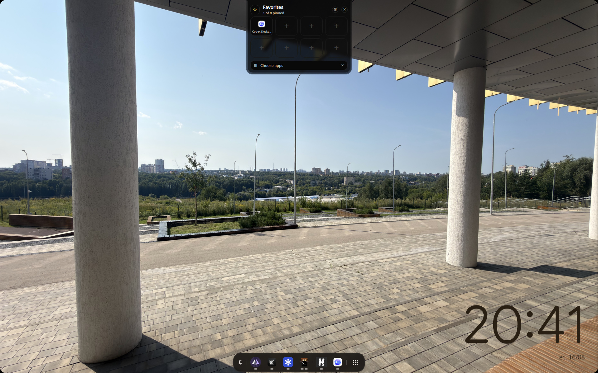
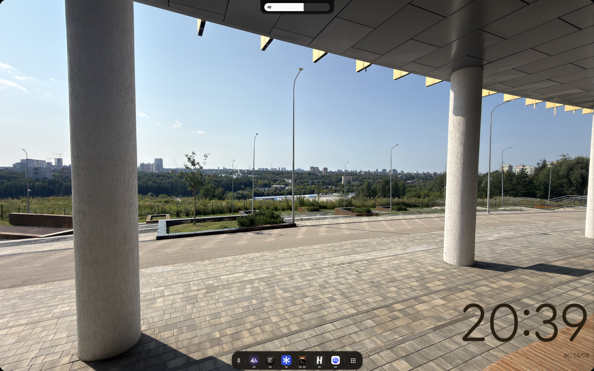

# Dynamic Glacier

Dynamic Glacier is a native QML/Quickshell control island for Hyprland.

It keeps media, Wi-Fi, Bluetooth, battery health, favorite apps, privacy activity,
and lightweight desktop feedback in one animated top-center surface. The default
look stays compact and OLED-friendly; an experimental Liquid Glass mode adds
real compositor-backed transparency and blur when you want the desktop to show
through.

No Electron, webview, AGS, EWW, or JS/HTML/CSS UI stack — just Quickshell,
QtQuick, and native Linux services.

<p align="center">
  
</p>

## Install

<details open>
<summary><b>Arch Linux / AUR</b></summary>

Install from the AUR:

```sh
paru -S dynamic-glacier-git
```

Run it:

```sh
dynamic-glacier
```

For Hyprland autostart, add this to `~/.config/hypr/hyprland.conf`:

```ini
exec-once = dynamic-glacier
```

</details>

<details>
<summary><b>Fedora / COPR</b></summary>

The RPM package and COPR publishing workflow are being prepared. The public
`mavxa/dynamic-glacier` COPR is not live yet, so do not enable it until this
section links to the real project. For now, use the manual installer below or
build the RPM locally.

On older Fedora releases without a `quickshell` package, enable the Quickshell COPR first:

```sh
sudo dnf copr enable errornointernet/quickshell
```

Hyprland itself is not in the Fedora repositories, so it is only a weak dependency here. Install it from a COPR such as [`sachesi/hyprland`](https://copr.fedorainfracloud.org/coprs/sachesi/hyprland/) if you do not have it yet.

Run it:

```sh
dynamic-glacier
```

The packaged launcher registers autostart on first run: it appends `exec-once = dynamic-glacier` to `~/.config/hypr/custom/execs.conf` when that file exists (end-4 dots layout), otherwise to `~/.config/hypr/hyprland.conf`. It only does this once, tracked by `~/.local/state/dynamic-glacier/autostart-done`.

Material Symbols has no Fedora package, and the media controls use it for icons. Install the variable font per-user:

```sh
mkdir -p ~/.local/share/fonts
curl -Lo ~/.local/share/fonts/MaterialSymbolsRounded.ttf \
  https://github.com/google/material-design-icons/raw/master/variablefont/MaterialSymbolsRounded%5BFILL%2CGRAD%2Copsz%2Cwght%5D.ttf
fc-cache -f
```

To build the RPM yourself instead:

```sh
sudo dnf install rpm-build rpmdevtools
rpmdev-setuptree
spectool -g -R rpm/dynamic-glacier.spec
rpmbuild -bb rpm/dynamic-glacier.spec
```

The CI workflow always validates the source RPM. Publishing remains disabled
until the repository variable `COPR_PROJECT` and secret `COPR_CONFIG` are set.

</details>

<details>
<summary><b>Manual install</b></summary>

Clone the repository:

```sh
git clone https://github.com/mavxa/DynamicGlacier.git
cd DynamicGlacier
```

Run the installer:

```sh
bash install.sh
```

The installer:

- installs runtime dependencies on Arch (`pacman` + AUR helper), Fedora (`dnf` + Quickshell COPR), and Debian/Ubuntu (`apt`)
- refreshes the font cache so `Noto Sans` is available
- installs the config into `~/.config/quickshell/DynamicGlacier`
- installs a launcher into `~/.local/bin/dynamic-glacier`
- registers `exec-once = ~/.local/bin/dynamic-glacier` in `~/.config/hypr/custom/execs.conf` when that file exists (end-4 dots layout), otherwise in `~/.config/hypr/hyprland.conf`

Useful installer options:

```sh
bash install.sh --symlink
bash install.sh --skip-deps
bash install.sh --no-autostart
bash install.sh --doctor
```

If your Hyprland config is not at the default path:

```sh
bash install.sh --hyprland-conf /path/to/hyprland.conf
```

</details>

<details>
<summary><b>Uninstall</b></summary>

For the AUR package:

```sh
paru -Rns dynamic-glacier-git
```

For the Fedora package:

```sh
sudo dnf remove dynamic-glacier
```

Packaged installs leave the `exec-once = dynamic-glacier` line in your Hyprland config; remove it by hand.

For a manual install:

```sh
bash uninstall.sh
```

Non-interactive manual removal:

```sh
bash uninstall.sh --yes
```

</details>

## Preview

<details open>
<summary><b>Default OLED-black design</b></summary>

<table>
  <tr>
    <td width="50%"></td>
    <td width="50%"></td>
  </tr>
  <tr>
    <td align="center"><sub>Expanded idle state</sub></td>
    <td align="center"><sub>Minimal strip handle</sub></td>
  </tr>
  <tr>
    <td colspan="2"></td>
  </tr>
  <tr>
    <td colspan="2" align="center"><sub>Media player</sub></td>
  </tr>
</table>

</details>

<details open>
<summary><b>Experimental Liquid Glass</b></summary>

Liquid Glass uses Hyprland's real backdrop blur with a translucent QML surface.
It can be enabled from Glacier settings and applies consistently to every state.

<table>
  <tr>
    <td width="50%"></td>
    <td width="50%"></td>
  </tr>
  <tr>
    <td align="center"><sub>Media</sub></td>
    <td align="center"><sub>Settings</sub></td>
  </tr>
  <tr>
    <td></td>
    <td></td>
  </tr>
  <tr>
    <td align="center"><sub>Wi-Fi</sub></td>
    <td align="center"><sub>Bluetooth</sub></td>
  </tr>
  <tr>
    <td></td>
    <td></td>
  </tr>
  <tr>
    <td align="center"><sub>Battery health and power profiles</sub></td>
    <td align="center"><sub>Favorite apps</sub></td>
  </tr>
  <tr>
    <td colspan="2"></td>
  </tr>
  <tr>
    <td colspan="2" align="center"><sub>Volume feedback</sub></td>
  </tr>
</table>


</details>

## Features

<details open>
<summary><b>Current features</b></summary>

- Pure-black top-center island for Hyprland.
- OLED-friendly idle handle with `bump` and barely visible `strip` modes.
- Optional experimental Liquid Glass across every Glacier state, backed by Hyprland blur rather than a flat translucent color.
- Anti-corner notch smoothly merging island into screen edge.
- Hover expansion that can overlap windows instead of constantly resizing the Hyprland layout.
- Small constant reserved zone, so normal windows do not jump around.
- Focused-monitor placement through Hyprland.
- MPRIS media player with artwork, title, artist, position, timeline, seek, previous, play/pause, next, shuffle, repeat, and favorite controls (Material Symbols icons).
- Paused tracks stay in the media state instead of immediately collapsing to idle.
- Collapsed `bump` can show current time plus track artwork/play indicator when media is active.
- Tray indicators: circular battery charging chip, cava-style audio bars.
- Subtle open U-shaped trace for volume and brightness changes.
- Wi-Fi status and a built-in `nmcli` network manager with saved-profile reconnects.
- Native BlueZ Bluetooth panel with radio toggle, discovery, device connect/disconnect, and battery status.
- Clickable battery panel with health, cycles, capacity, voltage, the hardware-supported UPower charge limit, and system power-profile switching.
- In-island settings for Liquid Glass and idle width/height, saved automatically between restarts.
- Persistent `bump` / `strip` selection.
- Settings access from idle, media, Wi-Fi, Bluetooth, battery, favorites, and notification states.
- Microphone and camera privacy dots with separate colors and non-overlapping layout.
- PipeWire privacy detection plus local fallbacks for `pactl` microphone streams and `/dev/video*` camera users.
- Minimalist pill toggle for bump/strip mode switching.
- IPC commands for manual testing and integration scripts.

</details>

<details>
<summary><b>Customization</b></summary>

Open the gear inside Glacier to toggle experimental Liquid Glass, resize the
expanded idle surface, or reset the visual settings. Changes are saved
automatically in Quickshell's per-config state directory.

The `bump` / `strip` handle selector lives in the idle and media headers and is
persisted through the same settings store.

Additional defaults live in `quickshell/modules/dynamicGlacier/DynamicGlacier.qml`:

| Property | Default | Description |
|----------|---------|-------------|
| `handleStyle` | `"bump"` | Idle handle mode: `"bump"` (pill) or `"strip"` (thin line) |
| `liveLinksEnabled` | `true` | Enable live MPRIS, volume, brightness, privacy detection |
| `fontFamily` | `"Noto Sans"` | Font used across the widget |
| `bumpWidth` | `104` | Width of the idle bump handle (px) |
| `bumpHeight` | `24` | Height of the idle bump handle (px) |
| `stripWidth` | `98` | Width of the idle strip handle (px) |
| `stripHeight` | `4` | Height of the idle strip handle (px) |
| `peekWidth` | `340` | Width when hovering idle (expanded peek) |
| `peekHeight` | `132` | Height when hovering idle |
| `notifyWidth` | `438` | Width of notification state |
| `notifyHeight` | `74` | Height of notification state |
| `mediaWidth` | `380` | Width of media player state |
| `mediaHeight` | `132` | Height of media player state |
| `wifiWidth` | `500` | Width of the Wi-Fi manager |
| `btWidth` | `500` | Width of the Bluetooth manager |
| `batteryWidth` | `500` | Width of the battery panel |
| `reservedZone` | `24` (bump) / `0` (strip) | Top exclusive zone reserved for the island |
| `windowHeight` | `136` | Total window height for the layer surface |

Colors are defined inline in `IslandSurface.qml` and `IslandContent.qml`:

- `surfaceColor`: island background (`#000000` bump, `#0c0c0c` strip)
- `primaryText`: main text color (`#f7f7f7`)
- `secondaryText`: dimmed text (`#7f7f7f`)
- `microphoneIndicatorColor`: mic privacy dot (`#ff9f1a`)
- `cameraIndicatorColor`: camera privacy dot (`#35ff72`)

Wi-Fi management uses `nmcli`. Bluetooth uses Quickshell's native BlueZ service,
so device names, connection state, discovery, and battery updates stay reactive
without polling `bluetoothctl`.

</details>

<details>
<summary><b>Planned / possible later</b></summary>

- Notification bridge that does not fight existing end-4 notification services.
- More settings for modules, colors, and timeout behavior.
- More detailed privacy labels for active microphone/camera clients.
- Long-running progress state for commands, downloads, and file operations.
- VPN/network, DND, timer, and calendar activity states.
- Optional tighter integration with end-4 dots while keeping standalone usage clean.

</details>

## end-4 Friendly

<details open>
<summary><b>How it fits next to end-4 dots</b></summary>

Dynamic Glacier is designed to run nicely next to [end-4/dots-hyprland](https://github.com/end-4/dots-hyprland).

It deliberately avoids owning global desktop services that end-4 already handles well. For example, it does not register a standalone notification daemon by default, and volume feedback is only a subtle trace around the island instead of a second full volume OSD.

The goal is to be an optional companion widget for end-4 style Hyprland setups: minimal, black, Quickshell-native, and easy to wire into an existing dotfiles tree.

</details>

## Development

<details>
<summary><b>Run from the repo</b></summary>

From the repo root:

```sh
quickshell --path quickshell
```

Trigger states from another terminal:

```sh
quickshell ipc --path quickshell call dynamicGlacier demo
quickshell ipc --path quickshell call dynamicGlacier notify "Build finished" "Dynamic Glacier is alive" "Hello"
quickshell ipc --path quickshell call dynamicGlacier media "Night Drive" "Glacier FM" true ""
quickshell ipc --path quickshell call dynamicGlacier volume 72 false
quickshell ipc --path quickshell call dynamicGlacier brightness 83
quickshell ipc --path quickshell call dynamicGlacier privacy true false
quickshell ipc --path quickshell call dynamicGlacier privacy false true
quickshell ipc --path quickshell call dynamicGlacier privacy true true
quickshell ipc --path quickshell call dynamicGlacier privacyLive
quickshell ipc --path quickshell call dynamicGlacier toggleHandle
quickshell ipc --path quickshell call dynamicGlacier live true
quickshell ipc --path quickshell call dynamicGlacier wifi
quickshell ipc --path quickshell call dynamicGlacier bluetooth
quickshell ipc --path quickshell call dynamicGlacier battery
quickshell ipc --path quickshell call dynamicGlacier apps
quickshell ipc --path quickshell call dynamicGlacier settings
quickshell ipc --path quickshell call dynamicGlacier liquidGlass true
quickshell ipc --path quickshell call dynamicGlacier idleSize 360 140
quickshell ipc --path quickshell call dynamicGlacier batteryLimit true
quickshell ipc --path quickshell call dynamicGlacier batteryLimit false
quickshell ipc --path quickshell call dynamicGlacier powerProfile power-saver
quickshell ipc --path quickshell call dynamicGlacier powerProfile balanced
quickshell ipc --path quickshell call dynamicGlacier powerProfile performance
quickshell ipc --path quickshell call dynamicGlacier idle
```

Toggle the looping demo:

```sh
quickshell ipc --path quickshell call dynamicGlacier demoLoop
```

More developer notes are in [`docs/development.md`](docs/development.md).

</details>

<details>
<summary><b>Verify manual install</b></summary>

Run doctor mode:

```sh
bash install.sh --doctor
```

It checks `quickshell`, the installed config, launcher, `Noto Sans`, `Material Symbols`, helper commands (`playerctl`, `upower`, `pactl`, `fuser`), and whether the Hyprland autostart entry is present.

</details>

## References

<details>
<summary><b>Links</b></summary>

- AUR package: https://aur.archlinux.org/packages/dynamic-glacier-git
- Quickshell COPR: https://copr.fedorainfracloud.org/coprs/errornointernet/quickshell/
- end-4 dots: https://github.com/end-4/dots-hyprland
- Quickshell docs: https://quickshell.outfoxxed.me/docs/
- Quickshell install/setup: https://quickshell.outfoxxed.me/docs/guide/install-setup/
- Quickshell distribution paths: https://quickshell.outfoxxed.me/docs/guide/distribution/

</details>
